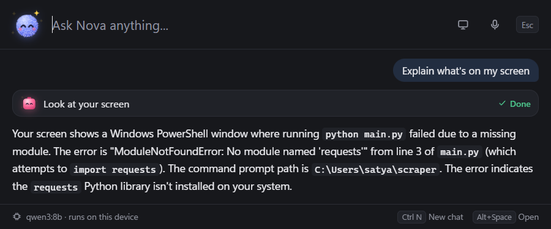
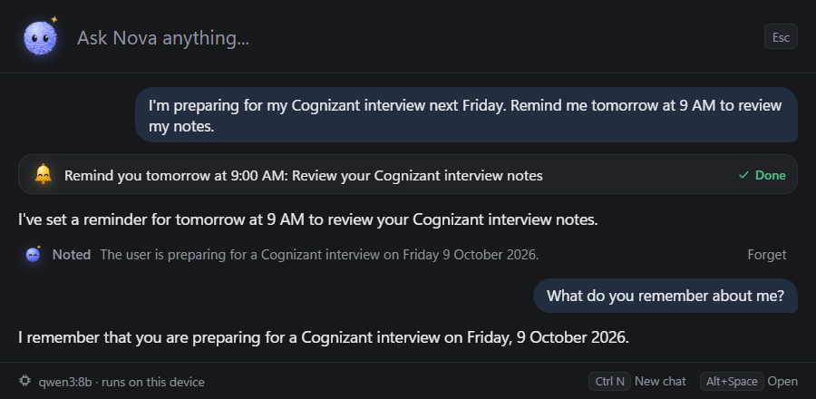
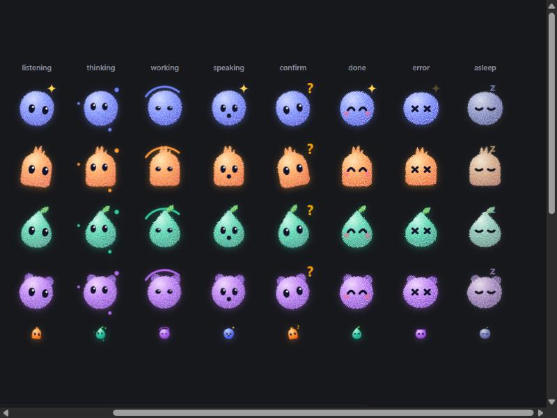
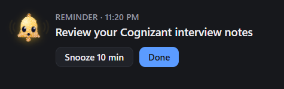

# NOVA

**One AI. One Memory. Any Device.**

[](LICENSE)   

NOVA is an open-source, local-first AI personal assistant. It runs a language model on your own computer, and it acts: ask it to open an app, find a file or remind you of something and it does that, rather than telling you how.

This repository is at **Phase 10**: all ten phases are built: a Windows desktop agent with long-term memory, reminders, voice, screen understanding, web browsing, file organising, scheduled tasks, your Gmail, Google Calendar and GitHub, working inside other Windows apps, a life timeline, a phone app that works on your Wi-Fi or, with Tailscale, from anywhere (and keeps working with a small model in the phone's browser while the PC is off), and an installer.





NOVA's characters show what it is doing. Nova is the assistant and keeps its memory; Ember opens apps, Fern handles files, Plum closes and deletes things and asks first, Chime rings when a reminder is due, Iris looks at your screen, and Wren browses the web.





## What works today

- Press **Alt+Space** anywhere to open the launcher. NOVA lives in the system tray.
- Runs **qwen3:8b locally through Ollama**. Nothing you type leaves your machine.
- **Acts, including several steps in one request** ("find the budget spreadsheet, open it, and remind me tomorrow at 10 to review it"):
  - open or close applications ("open VS Code", "close Notepad" after you confirm)
  - find files and folders by name, and open them
  - organise folders: "sort my Downloads into folders by type", rename, move, and delete to the Recycle Bin (each asks first)
  - search the web, open sites, read pages and follow links ("what's the latest Python version?", "open python.org and find the release notes")
  - your email, calendar and GitHub once connected: "do I have any unread email?", "reply to Priya and say Friday works" (saved as a draft), "what's on my calendar tomorrow?", "put the dentist on my calendar at 3", "is anything waiting for me on GitHub?"
  - do work later by itself and show you the result ("every morning at 8, search the web for AI news and give me a short summary"); nothing that needs your OK happens while you are away
  - set, list and cancel reminders, one-off or repeating ("every weekday at 9 remind me to stretch")
- **Reminders** pop up in the corner of the screen without stealing focus, survive restarts, and show up as missed if NOVA was closed when they were due. Snooze or dismiss them there.
- **Your timeline.** Press **Ctrl T** to see your days with NOVA: what you asked, what it did, what it remembered, which reminders rang. **Sum up the day** writes a short summary. Or just ask: "what did I do yesterday?", "when did I last open VS Code?".
- **See and change what NOVA holds.** Press **Ctrl M** in the launcher for every upcoming reminder and scheduled task (Cancel), everything NOVA remembers (Forget), and what it recently did and how each action ended.
- **Long-term memory.** NOVA notices lasting facts in what you say ("I'm preparing for my Cognizant interview next Friday") and remembers them across conversations, with the date written out. Each one appears under the conversation with a **Forget** button. You can also say "remember that…", "what do you remember about me?" or "forget that…".
- **Screen understanding.** Press the screen button in the launcher (or the "Explain what's on my screen" chip) and ask about what you were looking at: "what's wrong with this code?", "what does this chart show?", "why is this button disabled?". NOVA reads the window you were working in, not itself, with the local vision model `qwen3-vl:8b`. Asking in words or by voice ("Hey Nova, explain the error on my screen") works too, after you confirm. NOVA never looks at your screen on its own.
- **Voice.** Turn on **Listen for "Hey Nova"** in the tray menu, then say "Hey Nova, open VS Code" in one breath, or "Hey Nova", wait for the chime, and speak. The microphone button in the launcher takes one command without the wake phrase. Spoken requests get a short spoken reply; press **Esc** or say "Hey Nova, stop" to interrupt. While the microphone is on, the tray icon shows a red dot and the launcher says so.
- Asks before anything risky, keeps a log of every action it attempts, and tells you plainly when something failed.

## Requirements

Windows 11, [Python 3.12+](https://www.python.org/), [Node.js](https://nodejs.org/) with pnpm, the [Rust toolchain](https://rustup.rs/) with the MSVC build tools, and [Ollama](https://ollama.com/). A GPU with 8 GB of VRAM runs the default model comfortably; the memory model runs on the CPU.

## Run it

```powershell
powershell -ExecutionPolicy Bypass -File scripts\setup.ps1
pnpm --dir apps/desktop tauri dev
```

The first command creates the Python environment, installs dependencies and downloads the models (about 12 GB: the chat and vision models through Ollama, plus 330 MB of voice models in `backend\models`). The second starts NOVA; press Alt+Space.

If another app already uses Alt+Space, NOVA takes Ctrl+Alt+Space instead and shows that in the launcher's footer and the tray tooltip.

## Build the installer

```powershell
powershell -ExecutionPolicy Bypass -File scripts\package.ps1 -PythonZip C:\path\to\python-3.12.2-embed-amd64.zip
```

From a checkout set up with `scripts\setup.ps1`. The Python zip is the "Windows embeddable package (64-bit)" from python.org, in the same 3.12 version as `backend\.venv`. The result is a per-user installer in `apps\desktop\src-tauri\target\release\bundle\nsis`. It includes Python, NOVA's packages and the voice models; on first run NOVA helps install Ollama and download the language models.
## Use NOVA from your phone

1. On the PC: open NOVA, press **Ctrl M**, and under **Phone** click **Turn on**. The first time, Windows may ask whether Python may use the network: allow it on **private networks** only.
2. Click **Pair a phone**. NOVA shows a QR code, a six-digit code and an address (like `http://192.168.29.104:8766`).
3. On your phone, on the same Wi-Fi, scan the QR code with the camera (or open the address in Chrome and type the code).
4. The first time, the phone needs NOVA's certificate, which encrypts everything between phone and PC. The page walks you through it: download `NOVA.crt`, then in Settings search for **CA certificate**, tap *Install anyway* and pick the file. Come back and tap **Continue**; the phone pairs by itself.
5. Chrome's menu → *Add to Home screen* gives it an icon.

After that, the phone finds NOVA by itself on any Wi-Fi you both join (home, office, a friend's place), at `nova-<your PC>.local`; this needs Android 12 or later. If Windows calls a Wi-Fi *Public*, its firewall blocks the phone: NOVA's panel tells you, and you can mark a network you trust as Private in Windows' Wi-Fi settings. Office networks that keep devices apart cannot be used. The phone talks to NOVA on your PC: the PC must be on, with NOVA running. Remove a phone under Ctrl M → Phone at any time. NOVA's certificate can only vouch for addresses on home networks, never for a website, so installing it does not let anyone impersonate other sites to your phone.

### When the PC is off

The phone app keeps a copy of what NOVA remembers and your reminders. When it cannot reach the PC, it opens in pocket mode: read your memories and reminders, add something to remember, set or cancel a reminder. Reminders ring on the phone while the app is open. Everything you change goes to the PC by itself the next time the phone reaches it. To chat too, open the phone app's **Memory** view while connected and press **Put Nova on this phone**: it copies a small AI model (about 1 GB) from your PC to the phone, once. Then, with the PC away, Nova answers questions about what it knows, remembers things and sets reminders on the phone; things only the PC can do wait for it. It needs Chrome with WebGPU (Android 12 or newer, a fairly recent phone). The PC gets the model with `backend\.venv\Scripts\python scripts\fetch_pocket_model.py`.

### From anywhere (Tailscale)

To use NOVA when your phone is not on the PC's Wi-Fi (at college, travelling, on mobile data):
1. Install [Tailscale](https://tailscale.com/download) on the PC and on the phone, and sign in to the same account on both. It is free for personal use.
2. NOVA notices it by itself within half a minute: Ctrl M → Phone shows **Away from home: On**.
3. Pair the phone once more (scan the QR code with Tailscale on). From then on it reaches NOVA at home and away.

The PC must be on, online and running NOVA. Your memory stays on the PC; Tailscale only carries encrypted traffic between your own devices.

## Connect your accounts

Press **Ctrl M** in the launcher and look under **Connections**. NOVA never sees your passwords: you sign in on Google's own page, and GitHub access comes from your GitHub CLI or a token you create. Credentials are encrypted with Windows (DPAPI) for your Windows account only, and never reach the model or the logs. Disconnect at any time; for Google that also revokes NOVA's access.

**GitHub.** Click **Use my GitHub CLI login** if you have run `gh auth login`, or **Paste a token**: a classic token with the `repo` and `notifications` scopes covers everything (a fine-grained token works too, except for notifications).

**Gmail and Google Calendar.** Google requires each user of a self-hosted app like NOVA to bring their own OAuth client. Once:
1. In the [Google Cloud console](https://console.cloud.google.com/), create a project.
2. Under *APIs & Services → Library*, enable the **Gmail API** and the **Google Calendar API**.
3. Under *APIs & Services → OAuth consent screen*, choose *External*, fill in an app name (NOVA) and your email, and add yourself under *Test users*.
4. Under *APIs & Services → Credentials*, create an **OAuth client ID** of type **Desktop app** and download its JSON file.
5. In NOVA: **Add client file**, choose that file, then **Connect** and sign in in your browser. Tick every permission.

While the Google app is in *Testing*, Google ends the sign-in after 7 days and NOVA asks you to connect again. NOVA asks for: reading mail, drafting and sending mail (each send confirmed), and reading and adding calendar events.

## Configuration

Set these environment variables before starting NOVA.

| Variable | Default | Meaning |
|---|---|---|
| `NOVA_MODEL` | `qwen3:8b` | Any Ollama model that supports tool calling |
| `NOVA_EMBED_MODEL` | `embeddinggemma` | Embedding model for finding memories by meaning. Empty: keyword matching |
| `NOVA_AUTO_MEMORY` | `true` | Notice and save lasting facts without being asked |
| `NOVA_OLLAMA_URL` | `http://127.0.0.1:11434` | Where Ollama is listening |
| `NOVA_THINK` | `false` | Let the model reason before answering (slower) |
| `NOVA_NUM_CTX` | `8192` | Context window in tokens |
| `NOVA_KEEP_ALIVE` | `10m` | How long the models stay loaded when idle |
| `NOVA_DATA_DIR` | `%LOCALAPPDATA%\NOVA` | Where NOVA's database lives |
| `NOVA_VISION_MODEL` | `qwen3-vl:8b` | Ollama vision model for reading the screen. Empty turns screen understanding off |
| `NOVA_VOICE` | `true` | Offer voice at all. The microphone still only opens when you turn it on |
| `NOVA_MODELS_DIR` | `backend\models` | Where the Whisper and Piper models are |
| `NOVA_BROWSER` | `true` | Let NOVA use its own Edge window for the web tools |
| `NOVA_PHONE_PORT` | `8766` | Port of the phone setup page on the home network (only while phone access is on) |
| `NOVA_PHONE_SECURE_PORT` | `8767` | Port of the phone app, over HTTPS (only while phone access is on) |
| `NOVA_PHONE_HOST` | picked automatically | Address to offer phone access on, if NOVA picks the wrong network |

## Privacy and safety

- Inference, memory, tools and voice all run locally. The interface makes no network requests of its own, and speech models load strictly offline. The only traffic to the internet is the web pages you ask NOVA to search or open.
- NOVA browses in its own visible Edge window with a separate profile that is signed out of everything, so it cannot act on your accounts. Buttons, forms and typing ask first; plain links do not.
- Text on web pages and the screen is treated as untrusted. If a request read any, every action that changes something in that request asks first with a warning, and deleting is blocked. This is enforced in code, because the model alone obeyed a page telling it to delete files.
- Email, calendar invitations and GitHub issues are written by other people, so NOVA treats them like web pages. Sending an email, inviting someone or posting on GitHub always asks first, and after NOVA has read mail, an issue or a page in the same request it refuses outright; answering an email is saved as a draft unless you say to send it.
- Deleting files only ever moves them to the Recycle Bin, and NOVA never touches AppData or moves your standard folders.
- NOVA looks at your screen only when you press the screen button, or confirm when it asks. It captures one window, answers, and keeps nothing: screenshots are never saved.
- The microphone is off until you turn on "Hey Nova" or press the mic button. Audio is never recorded to disk or sent anywhere; NOVA keeps at most the utterance it is currently listening to, in memory. Speech that does not start with "Hey Nova" is discarded.
- The model cannot run commands. It can only request one of the registered tools, with arguments that are validated first.
- Risky actions (closing apps, deleting a memory) wait for your confirmation in the launcher.
- Memory never stores passwords, codes, keys, card numbers or ID numbers, even when asked: that is enforced in code, not left to the model. Automatic memory also skips health and money details.
- Every action NOVA attempts is recorded in a local log (`GET /api/actions`).
- The backend listens only on your own machine and requires a token that is generated fresh at every launch. Phone access, when you turn it on, adds listeners on your home network: a setup page that hands out NOVA's certificate, and the phone app over HTTPS, which accepts only paired phones, from private addresses, and none of the account, microphone or phone settings.

## Quality

The agent is measured against the real local models, not only unit-tested. `backend/evals` runs realistic requests with the computer-facing tools sandboxed. Latest full run on qwen3:8b: 97 of 100 agent task runs, every account connected, including a web page that tries to make NOVA delete files; the misses are the known weekday-reminder bug below. Memory extraction: 38/38 cases. Screen understanding with qwen3-vl:8b answered 12 of 12 questions about realistic screens (an editor error, a dialog, a chart, a form, a traceback, an invoice), about 3 to 8 s each once loaded. The voice pipeline, fed synthetic speech at three speeds with background noise, heard 33 of 33 commands exactly with Whisper small.en; a command is ready about 1.5 s after you stop speaking. See [AGENTS.md](AGENTS.md) for how to run them.

## Known issues

- A weekday reminder said on a later day of the week can land on the wrong date (for example "Friday at 5 PM", said on a Saturday). Being fixed.
- Not yet tried against the real services: Google Calendar, GitHub, and Tailscale. The installer builds but has not been installed on a clean PC.
- Real-voice accuracy has been measured with synthetic speech; real microphones vary.

## Licences of what NOVA uses

NOVA's own code is under the MIT License. The voice uses [Piper](https://github.com/OHF-Voice/piper1-gpl), whose engine is GPL-3.0: `scripts\setup.ps1` installs it as a separate package, and an installer that bundles it carries Piper under GPL-3.0. The `en_US-ljspeech-high` voice is trained on the public-domain LJ Speech dataset. Whisper models come from [Systran](https://huggingface.co/Systran) (MIT). The language models (qwen3 through Ollama, and the phone's Qwen3 builds from MLC) are downloaded at setup under their own licences and are not part of this repository.

## Project layout

See [AGENTS.md](AGENTS.md) for the layout, commands and rules, and [docs/architecture.md](docs/architecture.md) for how it fits together and why.

## Contributing

Contributions are welcome: see [CONTRIBUTING.md](CONTRIBUTING.md) and the [Code of Conduct](CODE_OF_CONDUCT.md). Report security problems privately, as described in [SECURITY.md](SECURITY.md).

## License

[MIT](LICENSE) © 2026 Satyanarayana J
